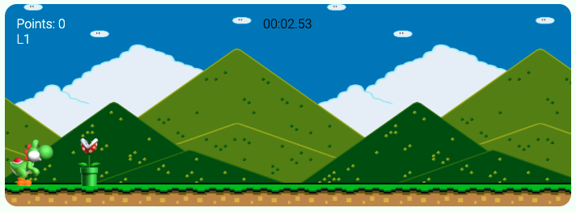

# Yoshi Run

## Description

    This project is about Yoshi, who is part of a loop of random obstacles coming his way. The goal is, jump over the obstacles as the timer rolls; and you score a point every time you successfully jump over the obstacle.

    It has a very simple and clean design. You just have to click on the button in the main page, and that will redirect you to the game.

## Instruction

    In order to play Yoshi Run, click on the "LET'S PLAY" button and use the Space Key to jump. 

    *The game will automatically start when you click on the button, so be ready to start jumping the obstacles.*

## Demo
[this is the link to the game] (https://thalitadosreis.github.io/yoshi-run/)