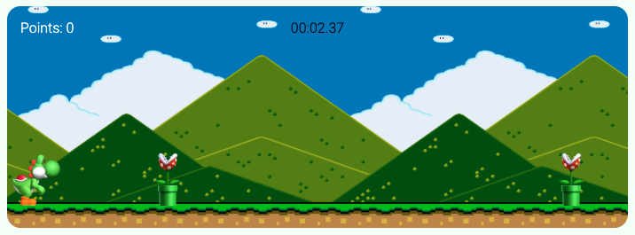

# Yoshi Run

## Description

This project is about Yoshi, who is part of a loop of random obstacles coming his way. 

The goal is, jump over the obstacles as the timer rolls; and you will score a point for every time you successfully jump over the obstacle. Plus, for every 10 obstacles jumped over, you get to level up. The obstacles' speed will increase as you level up.

It has a very simple and clean design. You just have to click on the button in the main page, and that will redirect you to the game.

## Instruction

In order to play Yoshi Run, click on the "LET'S PLAY" button and use the Space Key to jump. 

*The game will automatically start when you click on the button, so be ready to start jumping the obstacles.*

## Demo

[Check it out](https://thalitadosreis.github.io/yoshi-run/)